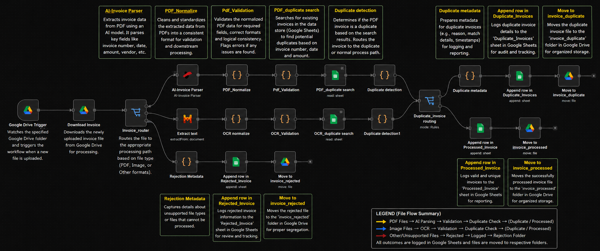
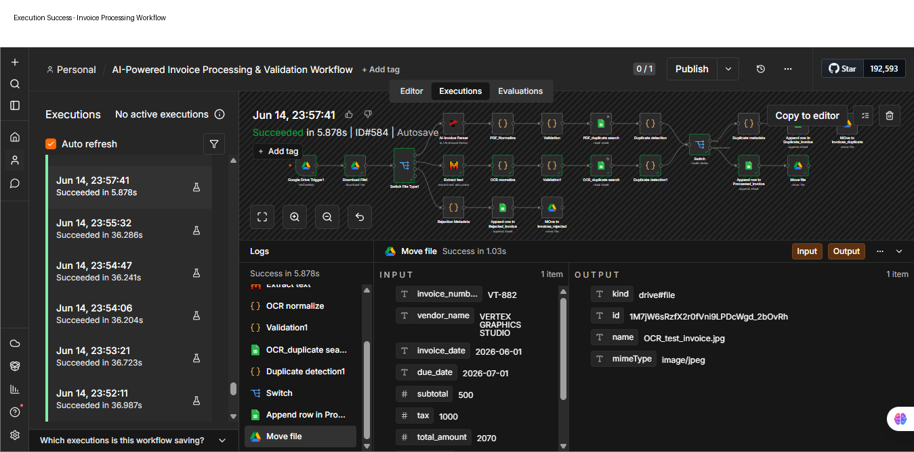

# AI-Powered Invoice Processing & Validation Workflow

## Overview

This project is an end-to-end invoice processing automation built with n8n. The workflow automatically monitors Google Drive for new documents, routes files based on type, extracts invoice data, performs validation and duplicate detection, and organizes processed files into appropriate folders while maintaining audit logs in Google Sheets.

## Key Features

### Automated Document Intake

* Monitors a Google Drive folder for incoming files.
* Automatically downloads and processes new documents.

### Intelligent File Routing

* PDF invoices are routed to the PDF extraction pipeline.
* Image invoices are routed to the OCR extraction pipeline.
* Unsupported file formats are routed to a rejection workflow.

### Data Extraction & Normalization

* Extracts invoice information from PDFs and images.
* Normalizes output into a consistent data structure.

### Quality Validation

* Verifies required invoice fields.
* Identifies incomplete or low-quality extractions.

### Duplicate Detection

* Detects invoices that have already been processed.
* Prevents duplicate records from entering the main reporting flow.

### Exception Handling

* Unsupported file formats are automatically rejected.
* Rejected documents are logged for review.

### Automated File Management

* Successfully processed invoices are moved to a Processed folder.
* Duplicate invoices are moved to a Duplicate folder.
* Rejected files are moved to a Rejected folder.

### Audit Logging

* Valid invoices are logged to Google Sheets.
* Duplicate invoices are logged to Google Sheets.
* Rejected invoices are logged to Google Sheets.

---

## Workflow Architecture

```text
Google Drive Trigger
        │
        ▼
   Download File
        │
        ▼
    Switch Node
   (File Type)

 ┌──────┼───────┐
 │      │       │

 ▼      ▼       ▼

PDF   Image  Unsupported
Path  Path   File

 │      │       │
 ▼      ▼       ▼

PDF    OCR   Log Rejection
Parser Parser      │
 │      │         ▼
 ▼      ▼   Move to Rejected
Normalize Normalize   Folder
 │      │
 ▼      ▼
Quality Check
 │
 ▼
Duplicate Search
 │
 ▼
Duplicate Detection
 │
 ▼
Switch Node
(Duplicate?)

 ┌───────────┴───────────┐
 ▼                       ▼

Duplicate            Valid Invoice
Invoice              Invoice

 ▼                       ▼

Append Row         Append Row
Duplicate Tab      Processed Tab
Google Sheet       Google Sheet

 ▼                       ▼

Move to            Move to
Duplicate Folder   Processed Folder
```

---
## Processing Flow

1. Monitor incoming invoices in Google Drive.
2. Route files based on MIME type.
3. Extract invoice data using:
   - PDF4me AI Parser (PDF invoices)
   - Mistral OCR (Images)
4. Normalize extracted fields into a common schema.
5. Validate mandatory invoice information.
6. Detect duplicate invoices using invoice number, vendor and amount.
7. Store results in Google Sheets repository.
8. Automatically move invoices to:
   - Processed
   - Duplicate
   - Rejected folders
  
## Business Outcomes

* Automated invoice intake and processing
* Reduced manual data entry
* Duplicate invoice prevention
* Automated exception handling
* Automated document organization
* Centralized audit trail in Google Sheets
* Scalable workflow architecture

## Technologies Used

* n8n
* Google Drive
* Google Sheets
* PDF Parsing Services
* OCR Services
* JavaScript Code Nodes

## Repository Structure

```text
Ai-Invoice-Processing-Workflow-n8n/
│
├── README.md
├── LICENSE
├── .gitignore
│
├── workflows/
│   └── ai-powered-invoice-processing-validation-workflow.json
│
└── screenshots/
    ├── workflow-overview.png
    ├── execution-success.png
    ├── results.png
    └── architecture-diagram.png
```

## Workflow File

The complete n8n workflow can be imported directly into any n8n instance.

**Workflow JSON:**

- [AI-Powered Invoice Processing & Validation Workflow](workflows/ai-powered-invoice-processing-validation-workflow.json)

## Configuration Required

All credentials, folder IDs, spreadsheet IDs, API keys, and account-specific identifiers have been removed from this repository before publication. Before running this workflow:

1. Create Google Drive folders:

   * Incoming Invoices
   * Processed Invoices
   * Duplicate Invoices
   * Rejected Invoices

2. Create a Google Sheet with:

   * Processed_invoice
   * Duplicate_invoice
   * Rejected_invoice

3. Configure credentials:

   * Google Drive OAuth2
   * Google Sheets OAuth2
   * PDF4ME API
   * Mistral AI API

4. Replace all placeholder IDs with your own resources.


### Import Instructions

1. Download the workflow JSON file.
2. Open n8n.
3. Click **Import from File**.
4. Select the downloaded workflow.
5. Reconfigure credentials for:
   - Google Drive
   - Google Sheets
   - PDF Parser
   - OCR Service
6. Update folder IDs and spreadsheet IDs as required.
7. Execute the workflow.


## Screenshots

### Workflow Overview



## Results


The workflow successfully:
- Processes PDF invoices
- Processes image invoices through OCR
- Detects duplicate invoices
- Rejects unsupported file formats
- Logs all outcomes to Google Sheets
- Moves files to Processed, Duplicate, and Rejected folders automatically

## Successful Workflow Execution



The workflow successfully processed invoices through the PDF/OCR pipelines, performed validation and duplicate detection, logged results to Google Sheets, and automatically moved files to the appropriate Google Drive folders.

## Future Enhancements

* Database integration
* Approval workflow
* Vendor validation
* ERP integration
* Analytics dashboard
* AI-powered extraction improvements
* Human-in-the-loop verification queue for invalid invoices
